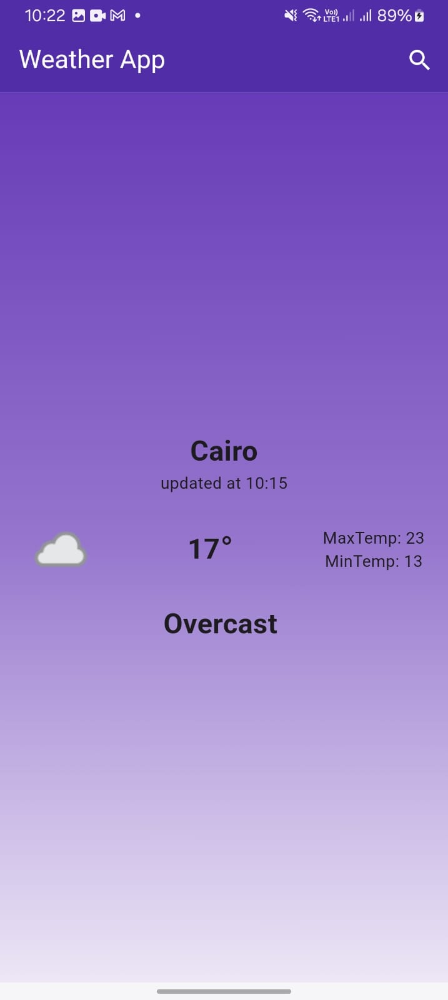

# 🌤 Weather App

A Flutter-based Weather App that allows users to search for real-time weather updates for any city. Built using **Bloc (Cubit)** for state management and **Dio** for API integration.

---

## 📌 Features

- ✅ Search for weather in any city 🌍  
- ✅ Real-time weather updates from Weather API ⏳  
- ✅ Dynamic UI theme based on weather conditions 🎨  
- ✅ State management using Cubit (Bloc) ⚙️  
- ✅ Error handling for API requests ❌  
- ✅ Clean and responsive UI 📱  

---

## 🛠 Technologies Used

- **Flutter** - UI framework  
- **Dart** - Programming language  
- **Bloc (Cubit)** - State management  
- **Dio** - HTTP client for API calls  
- **Weather API** - Fetching real-time weather data  

---

## 🚀 Installation & Setup

1. **Clone the repository**  
   ```bash
   git clone https://github.com/yourusername/weather_app.git
2. **Navigate to the project folder**
   ```bash
   cd weather_app
3. **Install dependencies**
   ```bash
   flutter pub get
4. **Run the app**
   ```bash
   flutter run
   
---

## 🔧 How It Works

1. The user searches for a city 🌍.  
2. The app fetches weather data using the **Weather API** 🌦.  
3. The UI updates dynamically based on weather conditions 🎨.  
4. The app uses **Cubit (Bloc)** for state management ⚙️.

---

## Screenshots 🖼️

| No Weather | search | weather|
|------------|---------------|--------------|
|  |  |  |

---

## 📄 API Integration

This app uses **WeatherAPI** to fetch real-time weather data. You need an API key to run the project. Replace `YOUR_API_KEY` in the code with your actual key.  

🔗 [Get your API key here: WeatherAPI](https://www.weatherapi.com/)  
